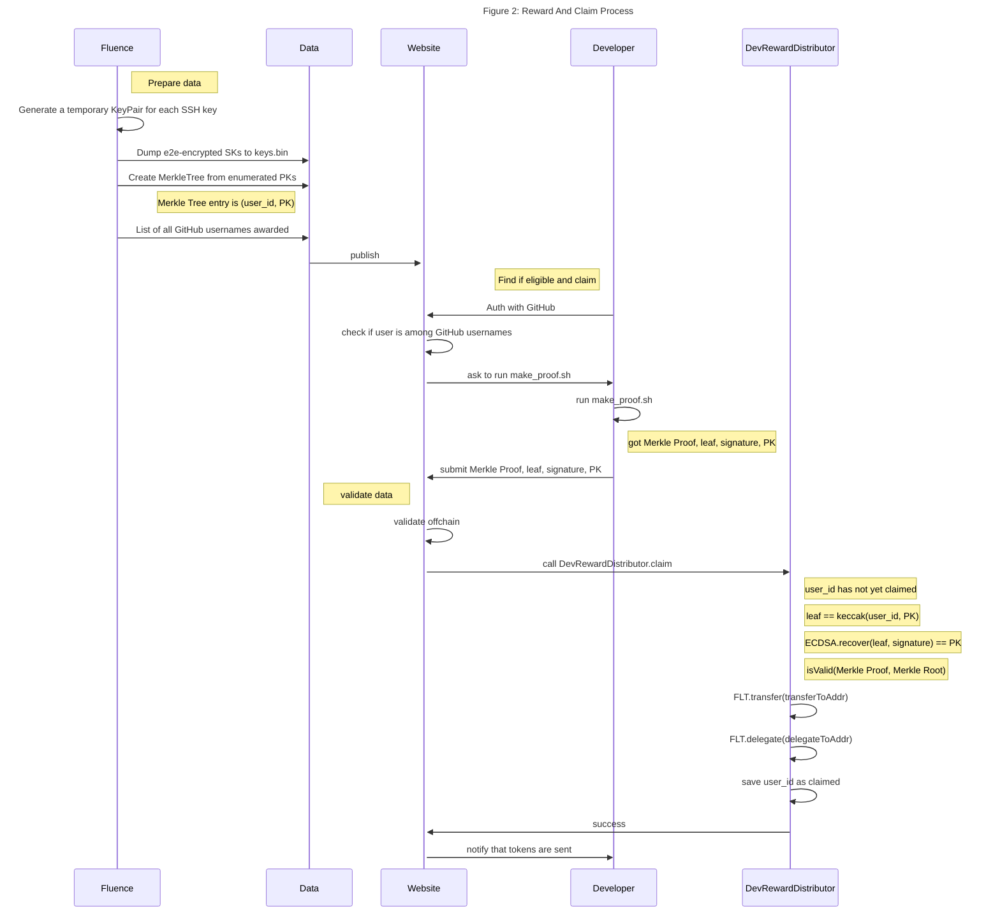
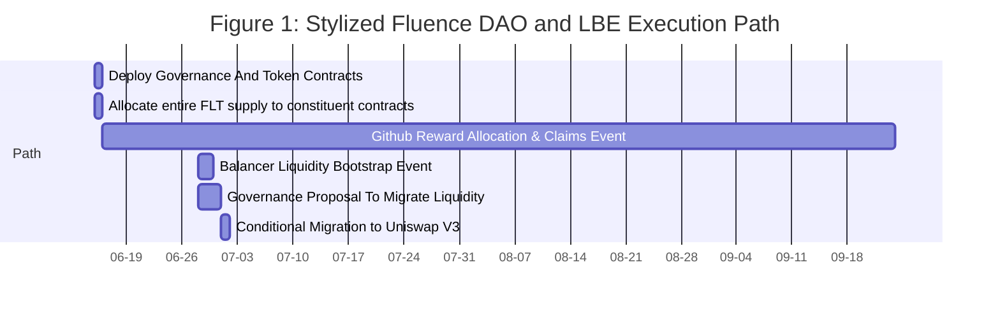

# Fluence DAO And Liquidity Bootstrapping Solution

## Overview

[Fluence](https://fluence.network/), an off-chain, decentralized peer-to-peer FaaS, aka compute, protocol and solution stack, is preparing to transition protocol governance to the community. In order to achieve this goal,a DAO, ERC20 token and liquidity bootstrapping solution need to be design and implemented. Moreove,r Fluence wants to recognize contributions not only to the Fluence protocol but also to the Web3 peer-to-peer open source community.

Previous efforts, such as the [Radicle Liquidity Bootstrapping Event](https://lbp.radicle.network/) and the [Gitcoin Token Distributor Event](https://gitcoin.co/blog/architecting-buidling-the-gtc-token-distributor/), provide a tried solution path and supporting contract repository. Nevertheless, core contracts such as governance and liquidity pool have evolved since those projects executed their events and these changes need to be reflected in the Fluence solution.

The expectations are that the Fluence community is comprised of a large number of token holders provably dedicated to Web3, decentralized FaaS and peer-to-peer. The remainder of this document outlines the solution components, roll-out path and, where applicable, expected outcomes. Please note that specified parameter values are tentative for the time being.

## Component Review

### Governance And ERC20 Token

Fluence wants to implement an on-chain governance solution using the upgradeable [Open Zeppelin Governance And Delegation](https://docs.openzeppelin.com/contracts/4.x/api/governance) contracts.

Table 1: Preliminary Governance Parameters
| Action | Min Voting %age | Voting Period |
|---|---|---|
| On-Chain Proposal | 1 | NA|
| Vote Participation (Quorum) | 4 | NA|
| Default Voting Period | NA | 3 Days |

The relevant Fluence contracts and deployment scripts can be found [here](https://github.com/fluencelabs/token-wip). The _Fluence Token_, [_FLT_](https://github.com/fluencelabs/token-wip/blob/5b5de3e9940a27c8d4f9c5cef189b177e9b2bbe0/tasks/token.ts#L10), is specified in [ten (10) decimals](https://github.com/fluencelabs/token-wip/blob/5b5de3e9940a27c8d4f9c5cef189b177e9b2bbe0/contracts/imports/governance/token.sol#L24) with a [total supply](https://github.com/fluencelabs/token-wip/blob/5b5de3e9940a27c8d4f9c5cef189b177e9b2bbe0/tasks/token.ts#L11) of 1,000,000,000 units.

### Token Allocation

Fluence intends to distribute the total ERC20 supply to the following constituents in the following proportions:

Table 2: Preliminary Token Allocation Model -- Subject to Change
| Target Group | Allocation (%)| Lockup| Vesting |
|---|---|---|---|
| DAO Treasury | 45 | No | No |
| Community Reward| 10 | Yes | No |
| Investors | 25 | Yes | Yes |
| Fluence Labs | 20| Yes | Yes |

While the proportional allocation to the various groups is straight forward and includes token lockup and vesting, it is desired that that granted but unvested tokens are available for governance purposes, i.e. propose and vote.

A [reference contract](https://github.com/fluencelabs/token-wip/blob/main/contracts/Shares.sol) has been developed to handle share allocations and vesting, although a simpler, script-based allocation scheme is the preferred implementation.

### Reward Allocation

Fluence's reward solution follows but not entirely duplicates the Handshake and Gitcoin models. Fluence has developed a community reward contribution filter for Github contributors whose public ssh keys are paramount in enabling a privacy-first rewards claim model.

#### Allocation Filter

Fluence is managing the allocation filter and will deliver a _CVS_ file for the reward allocation and claims proof verification including the following data:

Table 3: Reward CVS Format

| username | key-name public key |
| -------- | ------------------- |
| ...      |

#### Claim Generation

To claim a community reward, a designee needs to provide a signed message, aka claim proof, and submit it to the pertinent smart contract. This process needs to be as easy as possible for claimants and will entail a dedicated [web site](https://nsvdev.github.io/fluence/#/fluence) to verify reward eligibility and submit a reward claim. Due to the sensitive nature of transaction signing, the claim proof generation should be executed on the claimants local machine. To keep things simple and provide high quality assurances to claimants that the signing process is "sandboxed" locally, we propose the use of a `--no network` [docker container](https://github.com/fluencelabs/token-wip/tree/main/reward/docker) to execute the [script](https://github.com/fluencelabs/token-wip/tree/main/reward) to create the proof.

The claim itself is [generated](https://github.com/fluencelabs/token-wip/blob/oz-governor/reward/generate.sh) for each designee by encrypting a temporary Ethereum wallet private key with the designee's public ssh key and committed to a `bin` file. Moreover, the (Keccak) hash of each designee's Github user name and public key is committed as a leaf of a [Merkle Tree](https://github.com/fluencelabs/token-wip/tree/oz-governor/reward/merkle_proof).

The overall reward and claim process is capture in Figure 2 below:

#### Eligibility Check And Claim's Web Site

The [web site](https://github.com/nsvdev/fluence/tree/integrate_proof_script) to verify reward eligibility and submit a claim proof utilizes some of these [scripts](https://github.com/fluencelabs/token-wip/tree/main/reward).

#### Proof Generation

Github uses email address to link commits to the username and those emails can be easily obtained from the commit logs unless [otherwise specified](https://docs.github.com/en/account-and-profile/setting-up-and-managing-your-github-user-account/managing-email-preferences/blocking-command-line-pushes-that-expose-your-personal-email-address). This makes Github at best pseudo-anonymous, if set up correctly.

If we simply used a Github ssh key to sign a claims proof, a direct connection between the Github account and Ethereum account would be established. This linked relationship of keys undermines privacy at least within the pseudo-anonymous domain. In order to maintain the separation of claimants' Github and Ethereum personas, we introduce some cryptographic machinations discussed below.

### Liquidity Bootstrapping

Fluence intends to use [Balancer V2 Liquidity Boostrapping Pools](https://docs.balancer.fi/products/balancer-pools/liquidity-bootstrapping-pools-lbps) to initiate and calibrate a market and price for the Fluence governance token, FLT, and USDC. Following Radicle's path, Fluence also intends to put proposal to vote to move the liquidity after the Balancer bootstaping event ends to [Uniswap V3](https://uniswap.org/whitepaper-v3.pdf). This allows to take advantage of Balancer's flexible pool ratios to effectively bootstrap market pairs, especially a USDC-FLT pair, and then take advantage of the deeper Uniswap liquidity.

The expectations of the liquidity bootstrapping event is to start with a 92-8 ratio over a USDC-FLT pair and over the course of three (3) days arrive at near 50-50 distribution with a stable price of some USDC 5.00 for the USDC-FLT pair. See [Radicle code](https://github.com/radicle-dev/radicle-lbp) for a reference implementation.

Table 4a: Balancer V2 Bootstrapping

| FLT Allocation | USDC Allocation                 | Target Price |
| -------------- | ------------------------------- | ------------ |
| 2% of Treasury | Matching USDC From Fluence Labs | USDC ? (0.5) |

Table 4b: Balancer V2 Pool Exit

| USDC Proceeds | Unsold FLT |
| ------------- | ---------- |

| Loan back to Fluence
Rest To Treasury | To Treasury |

Table 4c: Uniswap V3 Pool

| USDC Allocation | FLT Allocation |
| --------------- | -------------- |
| From Treasury   | From Treasury  |

#### Other Post DAO Launch Activities

A governance forum discussion concerning the swap of FPT, a Fluence legacy token, to FLT needs to take place to determine the swap ratio and treasure allocation.

Table 4e: FPT For FLT Swap

| Swap Ratio | FLT Allocation     |
| ---------- | ------------------ |
| TBD:TBD    | TBD% From Treasury |

## Roll-Out And Deployment Plan

For roll-out purposes, we can differentiated between pre-governance and governance-based decision making.

