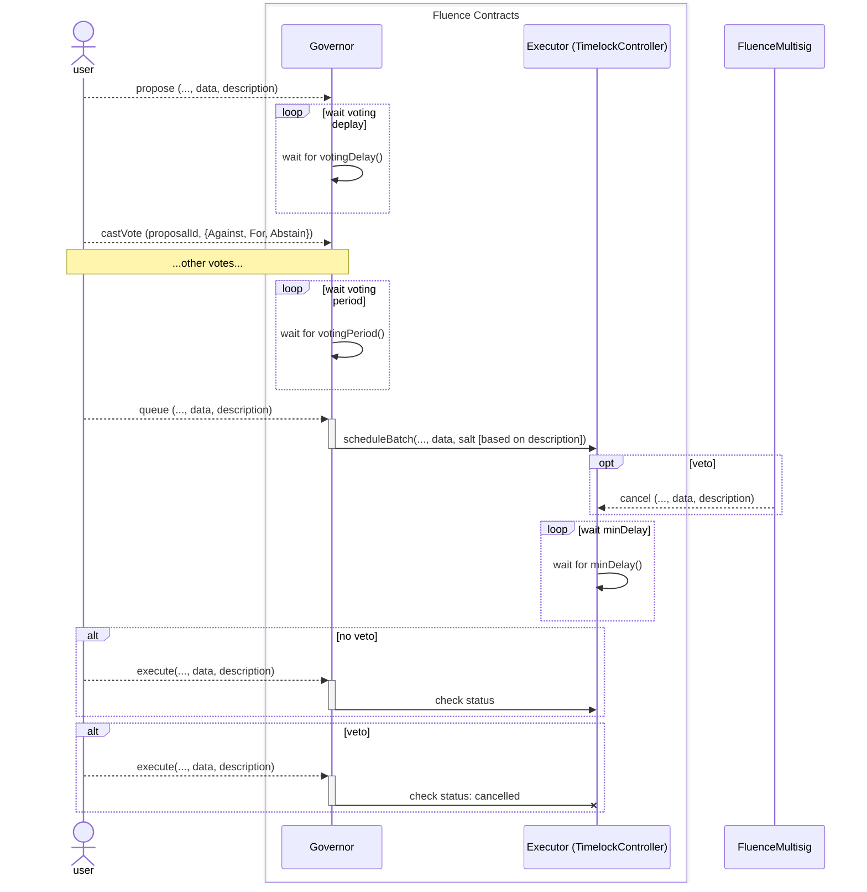
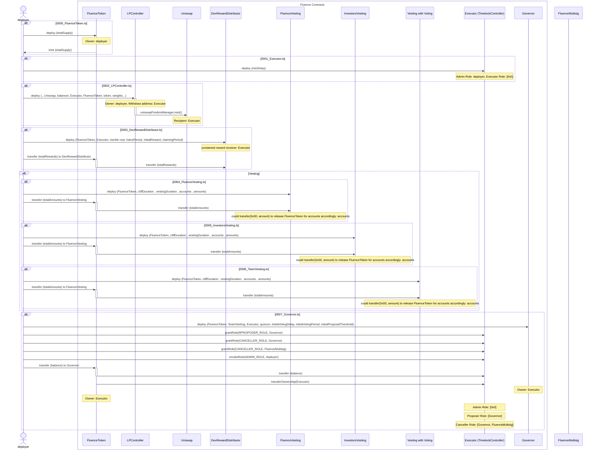

# Fluence DAO Contracts

This is solidity contracts for Fluence DAO. For DAO it uses OpenZeppelin contracts with modifications.

## Feature
- timelock DAO governor based on **TimelockControllerUpgradeable** and **GovernorUpgradeable** (OpenZeppelin contracts).
- everyone could **execute a proposal**
- **veto power**: Finally CANCELLER_ROLE is granted to `Governor` contract & `Fluence Multisig`. Veto could be applied after proposal is queued to execute (before it is executed).
- LBP Vesting with moving funds after specified time to Uniswap (TODO: write more precisely)
- 3 Vesting Contract with Delayed Start:
  - 2 to use different configs between Fluence team and investors
  - 1 with Voting
- [0003_DevRewardDistributor.ts](deploy%2F0003_DevRewardDistributor.ts) (TODO: write more precisely)
- **FluenceToken** based on **ERC20VotesUpgradeable** (OpenZeppelin) for the DAO purposes.

## DAO Proposal Flow

TODO: add other options like: threshold not reached, etc.


## Deploy & Role Delegation Flow
Deploy Flow according to [deploy scripts](deploy).



## Develop

### Install dep

> `npm install`

### Set config.yaml 
<details>
  <summary>Empty yaml example with description</summary>
    ```yaml
    networks:
      etherscanApiKey: {etherscan key}
      repotGas: true
      testnet:
        url:  {testnet eth node url}
        privateKey: {private key for testnet}
    
      mainnet:
        url:  {mainnet eth node url}
        privateKey: {private key for mainnet}
    
    deployment:
      contracts:
        usdToken: {usd token address}
        balancerLBPFactory: {balancer LBP factory address}
        uniswapFactory: {uniwap factory address}
        balancerVault: {balancer vault address}
    
      pool:
        lbpPoolDurationDays: {days duration of lbp}
        swapFeePercentage: {fee for lbp swap}
        flt:
          weight: {start weight}
          endWeight: {end weight}
          initialAmount: {initial amount}
        usd:
        weight: {start weight}
          endWeight: {end weight}
          initialAmount: {initial amount}
    
      token:
        totalSupply: {DAO total token supply}
    
      executor:
        delayDays: {delay from success proposal to execution}
    
      devRewardDistributor:
        merkleRoot: {reward from merkle reward tree}
        initialReward: {initial reward}
        totalRewards: {total reward of all users}
        halvePeriodMonths: {reward halve period}
        claimingPeriodMonths: {claim period in months}
    
      investorsVesting:
        delayDurationMonths: 1
        vestingDurationMonths: 1
        csvFile: {csv file with investors addresses and tokens}
    
      fluenceVesting:
        delayDurationMonths: 1
        vestingDurationMonths: 1
        account: {fluence account}
        amount: 10
    
      teamVesting:
        delayDurationMonths: 1
        vestingDurationMonths: 1
        csvFile: {csv file with team members addresses and tokens}
    
      governor:
        votingDelayDays: {delay from create voting to start voting}
        votingPeriodDays: {voting period for proposals}
        proposalThreshold: {min token for creating proposal}
    ```
</details>

on the other hand, the [config.example.yaml](config.example.yaml) represents file 
- to be copied as it is
- to be complete to run for **tests** after replacing "http://test.com" to the workable one for the Mainnet (we use fork, and for the tests as well).

TODO: why testnet

### Prepare Env

```bash
npm run compile
npm run typechain
```

## Start test

`npm test`

## Docs

[More info](https://github.com/fluencelabs/dao/contracts/DOC.md)
